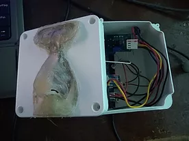

# Sensor de Sulfuro de Hidrógeno

Código fuente del proyecto "Sensor Olfativo Tipo Nariz Para Detectar La Presencia De Sulfuro De Hidrógeno Cerca De Aguas Residuales", [ingresa a la página web del proyecto](https://cristiangudelo63.wixsite.com/misitio).

Clona el repositorio con Git Bash con el comando:

```sh
$ git clone https://github.com/CristianAgudelo63/Sensor-de-Sulfuro.git
```

## Descargar las librerías
En el IDE de Arduino, descarga las librerías o blibliotecas para que funcione el código. Descarga las librerías que no tenga instalado:

- DHT sensor library
- MQUnifiedsensor
- SoftwareSerial

## Código en Arduino
_Es necesario tener instalado el IDE de Arduino en nuestro ordenador._

Ingresar a la carpeta `./Sensor-de-Sulfuro/code`, abre y ejecuta el código del archivo `code.ino` en el IDE de Arduino.

## Código en JavaScript y NodeJS
_Es necesario tener instalado el IDE de Arduino en nuestro ordenador y  tener instalado NodeJS._
    
Ingresar a la carpeta `./js` y ejecutar con NodeJS los siguientes comandos:

```sh
$ npm install johnny-five
$ npm install firmata-party
$ nmp install express
$ npm install socket.io
$ nmp install serialport
```

### Hola Mundo
Una vez instaladas todas las librerías, ingresar a la carpeta `./StandardFirmata.ino` y abrir el archivo `StandardFirmata.ino` en el IDE de Arduino, compilan y suben ese archivo a la tarjeta de desarrollo Arduino. Luego, escribe un "Hola Mundo" en johnny five para comprobar la conexión con la tarjeta y guarda el archivo como `helloWorld.js`.


Conecta un led en el pin 13 digital y a tierra (GND), corre el código con el siguiente comando:
```sh
$ node helloWorld.js
```
### Sensor
Abren una terminal y se dirigen a la ruta donde se encuenta el archivo `./js/code.js` y ejecutan el código del sensor con el siguiente comando:
```sh
$ node code.js
```

## Imágenes


